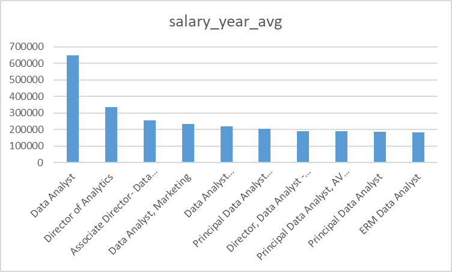

# SQL-Top-jobs

## Introduction

This SQL project analyzes the job market to identify the necessary skills for data analysts, data scientists, and other IT-related positions. It also examines job locations and salary ranges. This analysis provides valuable insights for aspiring professionals to align their skills with market demands.

Check the SQL Queries here: [project_sql folder](/SQL-Top-jobs/project_sql/)

## Background

The job market is constantly evolving, and it can be challenging to keep up with the latest trends and continouesly needs to upskill yourself.

The Question I want to answer through SQL queries are:
1. What are top paying data analyst jobs?
2. What skills are required for this top -paying jobs?
3. What skills are most in demand for data analysis?
4. Which skills are associated with higher salaries?
5. What are most optimal skills to learn?

## Tools I used

- **SQL:** The backbone of analysis, allowing me to query the database and gain critical insights.
- **PostgreSQL:** The chosen database management system, ideal for handling the job posting data.
- **Visual Studio Code:** My go to for database mangement and executing SQL queries.
- **Git & Github:** Essential for version control and sharing my SQL scripts and analysis, ensuring collaboration and project Tracking.

## The Analysis

1. Top Paying Data Analyst Jobs

## What I Learned

## Conclusion

#### Insignts

#### Closing Thoughts